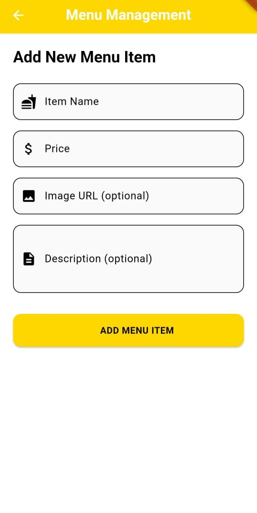

# 🍽️ Restaurant App

A clean, responsive Flutter mobile app that allows users to browse a restaurant menu, manage their cart, and sign in securely using Firebase Authentication. The app includes a simple admin panel to add items and uses GitHub Actions for CI/CD.

---

## 🔑 Features

- 🔐 **Firebase Authentication**
  - Email/password login & signup
  - Basic form validation
- 📋 **Menu Page**
  - Displays food items from Firestore
  - Shows name, price, and optional image
- 🛒 **Cart Page**
  - Add/remove items from a cart
  - View total price
- ⚙️ **Admin Page**
  - Add new menu items via UI (write to Firestore)
- 🎯 **State Management**
  - Local state using `Provider`
- 🚀 **CI/CD Setup**
  - GitHub Actions for automated testing and linting
- ✨ **Beautiful UI**
  - Yellow/white theme with modern clean design

---

## 📸 Screenshots

| Login | Signup | Menu |
|---|---|---|
|  |  |  |

| Cart | Add Item (Admin) |
|---|---|
|  |  |

---

## 🚀 Getting Started

### Prerequisites

- Flutter SDK (3.x or above)
- Firebase account
- Firebase CLI installed

### 🚀 Installation

```bash
# Clone the repository
git clone https://github.com/Jawadyyy/QuickBite.git

# Install Flutter dependencies
flutter pub get

# Configure Firebase (requires Firebase CLI)
flutterfire configure

# Run the app
flutter run
```

## 🧪 CI/CD with GitHub Actions

This repository includes GitHub Actions to ensure code quality. On every push or PR:

- ✅ `flutter analyze` is run  
- ✅ `flutter test` is run

### CI Status


---

## 🧰 Tech Stack

- Flutter  
- Firebase Authentication  
- Cloud Firestore  
- Provider (state management)  
- GitHub Actions (CI/CD)

---

## 📦 Packages Used

```yaml
dependencies:
  flutter:
    sdk: flutter
  firebase_core: ^2.0.0
  firebase_auth: ^4.0.0
  cloud_firestore: ^4.0.0
  provider: ^6.0.0
  fluttertoast: ^8.2.0
```

